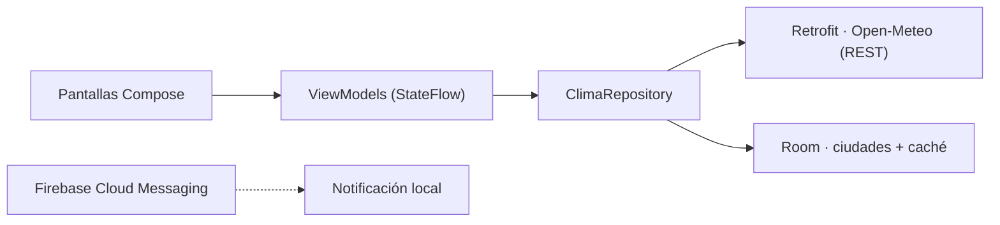

# MiClima ⛅

Aplicación móvil Android del clima, desarrollada en **Kotlin** con **Jetpack Compose**. Permite buscar cualquier ciudad del mundo, consultar el clima actual, el pronóstico por horas y a 7 días, guardar ciudades favoritas y seguir consultando los últimos datos **sin conexión** gracias a una caché local en **Room**. Recibe avisos meteorológicos por notificación push con **Firebase Cloud Messaging**.

> Proyecto académico. Los datos meteorológicos provienen de la API REST pública de [Open-Meteo](https://open-meteo.com/) (no requiere API key).

## Funcionalidades

- 🔍 **Búsqueda de ciudades** por nombre (API de geocodificación de Open-Meteo, resultados en español).
- 🌡️ **Clima actual**: temperatura, sensación térmica, humedad, viento, precipitación y condición con íconos.
- 🕐 **Pronóstico por horas** (próximas 24 horas) y 📅 **pronóstico a 7 días** (mín/máx y probabilidad de lluvia).
- ⭐ **Ciudades guardadas** en base de datos local Room, con su última temperatura conocida.
- ✈️ **Modo offline**: si no hay internet, se muestra el último pronóstico guardado con un aviso de la fecha de actualización.
- 🔔 **Notificaciones push** vía Firebase Cloud Messaging (tema `alertas_clima`) + Firebase Analytics.

## Tecnologías

| Tecnología | Uso |
|---|---|
| Kotlin 2.1 | Lenguaje de toda la app |
| Jetpack Compose (Material 3) | Interfaz de usuario declarativa |
| Navigation Compose | Navegación entre pantallas |
| ViewModel + StateFlow | Arquitectura MVVM y manejo de estado |
| Retrofit 2 + OkHttp + Gson | Consumo de la API REST de Open-Meteo |
| Room 2.6 | Base de datos local (ciudades y caché del pronóstico) |
| Firebase (FCM + Analytics) | Notificaciones push y analítica |
| JUnit 4 | Pruebas unitarias |

## Arquitectura

MVVM con patrón repositorio. La UI (Compose) observa `StateFlow` de los ViewModels; el repositorio decide entre red (Retrofit) y datos locales (Room):



```
app/src/main/java/com/miclima/app/
├── MainActivity.kt / MiClimaApp.kt
├── di/ServiceLocator.kt          → inyección de dependencias manual
├── data/
│   ├── remote/                   → Retrofit: GeocodingApi, ClimaApi + DTOs
│   ├── local/                    → Room: entidades, DAOs, AppDatabase
│   ├── repository/               → ClimaRepository (red + caché offline)
│   └── ClimaMapper.kt            → DTO → modelo de dominio
├── domain/Modelos.kt             → modelos que consume la UI
├── ui/
│   ├── screens/                  → CiudadesScreen, BuscarScreen, ClimaScreen
│   ├── navigation/AppNavHost.kt
│   └── theme/
├── viewmodels/
├── notifications/                → servicio FCM
└── util/                         → códigos WMO, fechas, Resultado
```

## Cómo ejecutar el proyecto

1. Instala [Android Studio](https://developer.android.com/studio) (incluye JDK 17 y SDK de Android).
2. Clona el repositorio y ábrelo en Android Studio (`File > Open`). La sincronización descargará Gradle 8.9 y las dependencias automáticamente.
   - Si compilas por línea de comandos y no existe `gradle/wrapper/gradle-wrapper.jar`, genera el wrapper una vez con `gradle wrapper` (o compila desde Android Studio, que no lo necesita).
3. Ejecuta la app en un emulador o dispositivo con **Android 8.0 (API 26) o superior**. Se necesita internet para descargar el pronóstico la primera vez.

### Configurar Firebase (para ver las notificaciones push)

El repositorio incluye un `app/google-services.json` **de plantilla** para que el proyecto compile. Para que FCM funcione de verdad:

1. Crea un proyecto en la [consola de Firebase](https://console.firebase.google.com/).
2. Agrega una app Android con el paquete `com.miclima.app`.
3. Descarga el `google-services.json` real y reemplaza el de `app/`.
4. Ejecuta la app (se suscribe sola al tema `alertas_clima`) y envía una notificación desde **Messaging** en la consola, ya sea una campaña de prueba al token del dispositivo (aparece en Logcat con el tag `FCM`) o al tema `alertas_clima`.

## Pruebas

```
gradlew.bat test        # Windows
./gradlew test          # Linux/Mac
```

Se prueban las utilidades de códigos meteorológicos WMO, el formateo de fechas y el mapeo de la respuesta de la API al modelo de dominio.

## Capturas y video

Las capturas de pantalla se encuentran en [`docs/capturas/`](docs/capturas/) y el guion del video demostrativo en [`docs/GUION_VIDEO.md`](docs/GUION_VIDEO.md). El reporte técnico completo está en [`REPORTE_TECNICO.md`](REPORTE_TECNICO.md).
