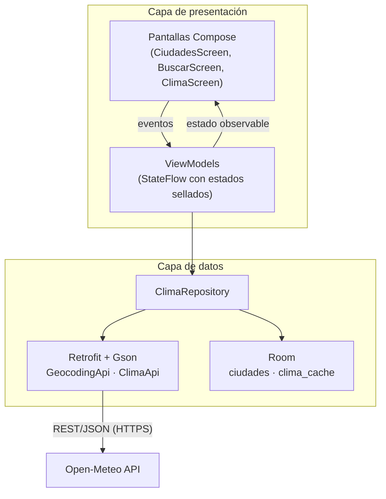

# Reporte Técnico — Aplicación Móvil "MiClima"

| | |
|---|---|
| **Proyecto** | MiClima — aplicación Android del clima |
| **Alumno** | _(nombre del alumno)_ |
| **Matrícula / Grupo** | _(completar)_ |
| **Materia** | _(completar)_ |
| **Fecha** | Agosto de 2026 |
| **Repositorio** | https://github.com/adolfoperezdias23-dotcom/mi-clima- |

---

## 1. Introducción y objetivo

MiClima es una aplicación móvil nativa para Android que permite consultar el estado del tiempo de cualquier ciudad del mundo: clima actual, pronóstico por horas y pronóstico a siete días. El usuario puede guardar sus ciudades de interés y volver a consultarlas incluso sin conexión a internet.

El objetivo del proyecto es demostrar el dominio de las tecnologías solicitadas en un producto funcional completo:

- **Kotlin** como lenguaje de programación.
- **Jetpack Compose** (Material 3) para la interfaz de usuario.
- **Firebase** (Cloud Messaging y Analytics) para notificaciones push y analítica.
- **Room Database** para persistencia local y funcionamiento offline.
- **API REST** (Open-Meteo) como fuente de datos en tiempo real.
- **GitHub** para el control de versiones del código fuente.

## 2. Alcance funcional

| # | Funcionalidad | Descripción |
|---|---|---|
| RF1 | Buscar ciudad | Búsqueda por nombre contra la API de geocodificación de Open-Meteo; resultados en español con región y país. |
| RF2 | Ver clima actual | Temperatura, sensación térmica, humedad, viento, precipitación, condición (texto e ícono) y si es de día o de noche. |
| RF3 | Pronóstico por horas | Próximas 24 horas con temperatura y probabilidad de lluvia. |
| RF4 | Pronóstico a 7 días | Mínima/máxima, condición y probabilidad de lluvia por día ("Hoy", "Mañana", día de la semana). |
| RF5 | Guardar ciudades | Las ciudades consultadas se guardan en Room y se listan con su última temperatura conocida. |
| RF6 | Eliminar ciudad | Desde la lista principal. |
| RF7 | Modo offline | Sin internet, la app muestra el último pronóstico guardado indicando la fecha de esos datos. |
| RF8 | Notificaciones push | La app se suscribe al tema FCM `alertas_clima`; los avisos llegan como notificación del sistema. |

## 3. Tecnologías y versiones

| Componente | Versión | Papel en el proyecto |
|---|---|---|
| Kotlin | 2.1.0 | Lenguaje único de la app |
| Android Gradle Plugin | 8.7.3 | Sistema de compilación |
| Gradle | 8.14.5 | Sistema de compilación |
| Jetpack Compose BOM | 2024.12.01 (Material 3) | Toda la interfaz |
| Navigation Compose | 2.8.5 | Navegación entre pantallas |
| Lifecycle / ViewModel | 2.8.7 | MVVM y ciclo de vida |
| Room | 2.6.1 (con KSP) | Base de datos local SQLite |
| Retrofit / OkHttp / Gson | 2.11.0 / 4.12.0 / 2.11.0 | Cliente HTTP de la API REST |
| Firebase BOM | 33.7.0 (Messaging + Analytics) | Push y analítica |
| Coroutines | 1.9.0 | Concurrencia (suspend/Flow) |
| JUnit | 4.13.2 | Pruebas unitarias |
| SDK | mín. 26 (Android 8.0) · objetivo 35 (Android 15) | Compatibilidad |

## 4. Arquitectura

Se aplicó **MVVM (Model–View–ViewModel) con patrón repositorio** e inyección de dependencias manual mediante un `ServiceLocator`:



Decisiones principales:

- **Estados sellados por pantalla** (`Cargando / Listo / Error`): la UI es una función del estado y no hay estados imposibles.
- **Repositorio como única fuente de datos**: la UI nunca sabe si el dato vino de la red o de Room. Estrategia *red primero, caché como respaldo*: cada pronóstico descargado se guarda en `clima_cache`; ante un fallo de red se sirve la última copia con la bandera `desdeCache = true`, que la UI muestra como aviso de "sin conexión".
- **`Resultado<T>` sellado** (`Exito`/`Error`) en lugar de excepciones hacia la UI.
- **Inyección manual (`ServiceLocator`)**: adecuada para el tamaño del proyecto; el mismo diseño permite migrar a Hilt sin tocar la UI.

## 5. API REST consumida (Open-Meteo)

API pública y gratuita, sin API key, sobre HTTPS.

| Endpoint | Método | Uso | Parámetros principales |
|---|---|---|---|
| `https://geocoding-api.open-meteo.com/v1/search` | GET | Buscar ciudades por nombre | `name`, `count=8`, `language=es`, `format=json` |
| `https://api.open-meteo.com/v1/forecast` | GET | Pronóstico completo | `latitude`, `longitude`, `current=…`, `hourly=…`, `daily=…`, `timezone=auto`, `forecast_days=7` |

Ejemplo (abreviado) de respuesta del pronóstico:

```json
{
  "timezone": "America/Mexico_City",
  "current": { "temperature_2m": 24.6, "relative_humidity_2m": 55,
               "apparent_temperature": 25.1, "is_day": 1,
               "weather_code": 2, "wind_speed_10m": 12.3 },
  "hourly": { "time": ["2026-08-06T00:00", "…"],
              "temperature_2m": [18.2, "…"],
              "precipitation_probability": [10, "…"],
              "weather_code": [2, "…"] },
  "daily":  { "time": ["2026-08-06", "…"],
              "temperature_2m_max": [26.0, "…"],
              "temperature_2m_min": [14.0, "…"],
              "precipitation_probability_max": [10, "…"],
              "weather_code": [2, "…"] }
}
```

El consumo se hace con **Retrofit** (interfaces `GeocodingApi` y `ClimaApi` con funciones `suspend`) y **Gson** para deserializar a DTOs. El campo `weather_code` usa la codificación meteorológica **WMO**; la utilidad `CodigosClima` lo traduce a descripción en español e ícono (p. ej. `0 = Despejado ☀️`, `61 = Lluvia ligera 🌧️`, `95 = Tormenta eléctrica ⛈️`).

## 6. Base de datos local (Room)

Dos tablas, expuestas con `Flow` para que la UI reaccione automáticamente a los cambios:

**Tabla `ciudades`** — ciudades guardadas por el usuario

| Columna | Tipo | Descripción |
|---|---|---|
| `id` (PK) | Long | Id del lugar según el servicio de geocoding |
| `nombre` | String | Nombre de la ciudad |
| `region` | String | Estado/provincia y país |
| `latitud`, `longitud` | Double | Coordenadas para pedir el pronóstico |
| `agregadaEn` | Long | Fecha de guardado (epoch ms), define el orden |

**Tabla `clima_cache`** — último pronóstico descargado por ubicación

| Columna | Tipo | Descripción |
|---|---|---|
| `clave` (PK) | String | `"lat,lon"` con 4 decimales |
| `json` | String | Respuesta completa de la API serializada |
| `actualizadoEn` | Long | Momento de la descarga (epoch ms) |

Esta caché cumple dos papeles: (1) modo offline en la pantalla de detalle y (2) mostrar la última temperatura conocida junto a cada ciudad en la lista principal (se combinan los `Flow` de ambas tablas en `CiudadesViewModel`).

## 7. Integración con Firebase

- **Cloud Messaging (FCM):** al iniciar, la app se suscribe al tema `alertas_clima`. El servicio `MiClimaMessagingService` recibe los mensajes (con la app en primer plano o mediante el canal por defecto en segundo plano) y publica una notificación local en el canal `clima_general` (creado en `MiClimaApp`, requisito desde Android 8). En Android 13+ se solicita el permiso `POST_NOTIFICATIONS` en tiempo de ejecución.
- **Analytics:** registro automático de sesiones y eventos de pantalla al incluir `firebase-analytics`.
- El repositorio incluye un `google-services.json` **de plantilla** (valores de relleno) para que cualquier persona pueda compilar; para demostrar FCM se reemplaza por el archivo real descargado de la consola de Firebase (véase README). Las llamadas a Firebase están protegidas con `runCatching`, de modo que la app funciona aun con la plantilla.

**Prueba de la notificación:** consola de Firebase → *Messaging* → *Nueva campaña* → notificación de prueba al token del dispositivo (visible en Logcat, tag `FCM`) o envío al tema `alertas_clima`.

## 8. Interfaz de usuario y navegación

Tres pantallas 100 % Jetpack Compose (Material 3), tema claro/oscuro automático:

| Pantalla | Ruta | Contenido |
|---|---|---|
| Mis ciudades | `ciudades` | Lista de ciudades guardadas (Room) con última temperatura; estado vacío ilustrado; FAB para buscar; botón de eliminar por ciudad. |
| Buscar ciudad | `buscar` | Campo de búsqueda con acción de teclado, indicador de carga, resultados con región/país; al tocar, guarda en Room y navega al detalle. |
| Pronóstico | `clima/{lat}/{lon}/{nombre}` | Encabezado con temperatura grande, condición y sensación; fichas de humedad/viento/precipitación; carrusel horizontal por horas; lista de 7 días; banner de modo offline; botón actualizar y reintentar. |

La navegación usa **Navigation Compose** con argumentos en la ruta (latitud, longitud y nombre codificado con `Uri.encode`).

## 9. Pruebas

Pruebas unitarias JVM (JUnit 4) de la lógica de negocio pura, ejecutables con `gradlew test`:

- `CodigosClimaTest` — traducción de códigos WMO (conocidos, desconocidos, variante día/noche).
- `FechasTest` — formateo de horas ISO y nombres de día ("Hoy", "Mañana", capitalización).
- `ClimaMapperTest` — mapeo DTO → dominio: clima actual, pronóstico diario y propagación de la bandera de caché.

## 10. Control de versiones (GitHub)

Repositorio Git con historial por capas (configuración → datos → interfaz → pruebas → documentación), rama principal `main`. El código fuente completo, este reporte, el guion del video y las capturas viven en el repositorio.

## 11. Instrucciones de compilación

1. Android Studio (JDK 17 incluido) → `File > Open` → carpeta del proyecto → esperar la sincronización de Gradle.
2. Ejecutar en emulador o dispositivo con Android 8.0+ (se pide internet para la primera consulta).
3. Opcional (FCM real): reemplazar `app/google-services.json` con el del proyecto propio de Firebase.
4. Pruebas: `gradlew.bat test`. APK de depuración: `gradlew.bat assembleDebug` (queda en `app/build/outputs/apk/debug/`).

## 12. Evidencias

Capturas de la aplicación ejecutándose en el emulador Pixel 8 desde Android Studio (archivos en `docs/capturas/`):

| Figura | Archivo | Descripción |
|---|---|---|
| 1 | `01-lista-vacia.png` | Pantalla principal en el primer arranque |
| 2 | `02-busqueda.png` | Búsqueda de ciudad |
| 3 | `03-resultados-busqueda.png` | Resultados de la geocodificación |
| 4 | `04-pronostico-monterrey.png` | Pronóstico completo de Monterrey |
| 5 | `05-ciudades-guardadas.png` | Ciudades guardadas (Room) |

- **Video demostrativo:** _(URL del video)_.

## 13. Conclusiones

El proyecto integra en una sola aplicación el ciclo completo de una app móvil moderna: consumo de una API REST real con Retrofit, persistencia y funcionamiento offline con Room, interfaz declarativa con Jetpack Compose bajo arquitectura MVVM, y servicios en la nube de Firebase para notificaciones push. La separación por capas (UI → ViewModel → Repositorio → Red/BD) hace el código verificable con pruebas unitarias y fácil de extender — por ejemplo, con widgets de pantalla de inicio, geolocalización del dispositivo o gráficas de temperatura.

## 14. Referencias

- Documentación de Open-Meteo: https://open-meteo.com/en/docs
- Jetpack Compose: https://developer.android.com/jetpack/compose
- Room: https://developer.android.com/training/data-storage/room
- Firebase Cloud Messaging: https://firebase.google.com/docs/cloud-messaging
- Retrofit: https://square.github.io/retrofit/
- Códigos meteorológicos WMO 4677: https://open-meteo.com/en/docs#weather_variable_documentation
